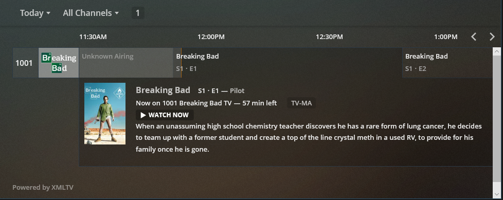
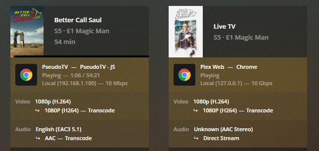
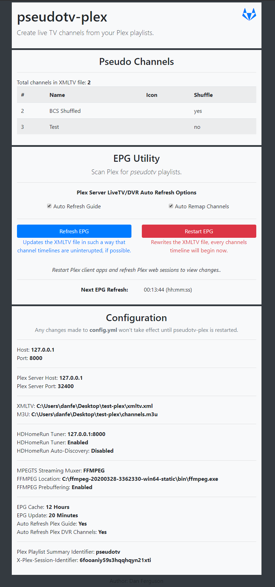

# pseudotv-plex

Create Live TV/DVR channels from playlists in Plex.



### How it works

1. pseudotv-plex will scan your Plex library for playlists, looking for playlists with a summary starting with **pseudotv**.
2. XMLTV and M3U files are generated from your **pseudotv** playlists, using metadata pulled from Plex.
3. Add the PseudoTV (spoofed HDHomeRun) tuner into Plex, use the XMLTV file as your EPG provider.
4. Watch your pseudo live tv channels

### Features

- Plex transcoding (psuedotv-plex spoofs a Chrome Web Player, in order to receive a h264/aac stream from Plex)
- FFMPEG or VLC mpegts transmuxing
- Prebuffering (FFMPEG only) - transcodes entire video as fast as possible (not live stream)
- Auto update Plex DVR channel mappings and EPG.
- Web UI for manually triggering EPG updates

**Critical Issues: Continuous playback is pretty much broken. I think the only way to get around that would be to transcode videos to a fixed framerate/bitrate. I really wish Plex documented their full API, there might be some parameters we can send to get such a stream..**

## Prerequisites

**So far only tested in Windows. Should work cross platform. Docker container support coming soon.**

Install [NodeJS](https://nodejs.org/), and either [VLC](https://www.videolan.org/vlc/) or [FFMPEG](https://www.ffmpeg.org/)

## Install
```
npm install
```

## Configure

You must provide your Plex server details and the location of VLC or FFMPEG

### Edit the **`config.yml`** configuration file

## Start
```
npm start
```

# Plex Playlist Setup

To assign a playlist as a channel, edit the summary of the playlist in Plex and write **pseudotv** at the beginning.

**optional parameters:** *channelNumber*, *iconURL* and/or *shuffle*. In any order..

If no channel number is specifed, the Plex playist's id/key is used.

## Plex Playlist Example
### Title
```
My Channel Name
```
### Summary
```
pseudotv 100 shuffle http://some.url/channel-icon.png
```

# Plex DVR Setup

Add the PseudoTV tuner to Plex. Use the **"Don't see your HDHomerun device? Enter its network address manually"** option if it doesn't show up automatically.

Use the generated XMLTV file as your EPG provider.

You wont be able to add the tuner to Plex until at least one channel has been generated.

# Plex Transcoding
When a channel is requested, pseudotv-plex will determine the current playing program and request a transcoded stream from Plex. When pseudotv-plex recieves the h264/acc stream,it is remuxed (using vlc or ffmpeg) into a mpegts container to be utilized by Plex DVR.



# PseudoTV Web UI

Manually trigger EPG updates and view active channels using the Web UI.

