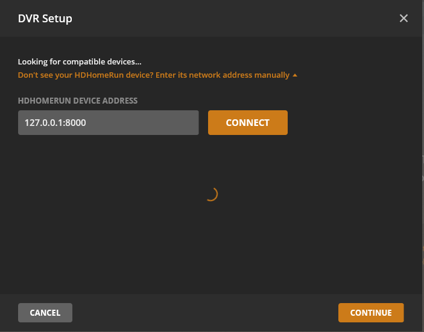
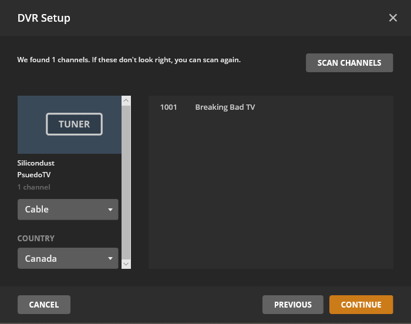
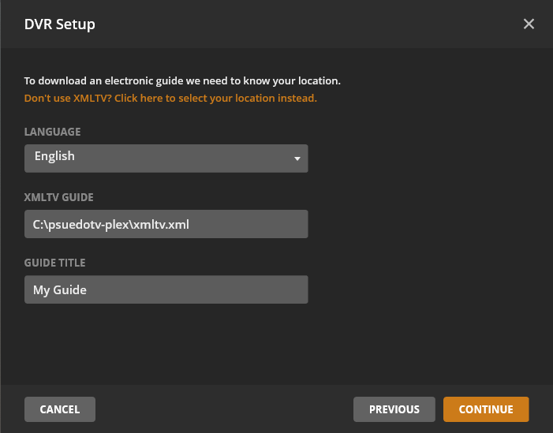

# pseudotv-plex

Create Live TV/DVR channels from playlists in Plex.


### How it works

1. psuedotv-plex will scan Plex for playlists. Playlists with a **summary** starting with **psuedotv** will be fetched.
2. XMLTV and M3U files are generated.
3. Add the psuedotv (spoofed HDHomeRun) tuner into Plex, use the XMLTV file for guide information.
4. When tuning to a channel, a VLC session will be **spawned on demand**, hosting the channel's video stream.
5. Whenever a playlist change is detected, an updated XMLTV file will be written

### Features

- Supports any video playlist in Plex, including Smart Playlists
- VLC sessions are spawned on demand. There will only ever be one VLC session per channel, no matter the number of viewers.
- VLC will **Direct Stream** if media is tagged **"optimizedForStreaming"** by Plex, otherwise VLC will transcode to h264/aac.
- EPG/Channels update automatically

## Install
```
npm install
```

## Configure
### You must provide your Plex server details and the location of VLC

Edit the **config.yml** configuration file

## Start
```
npm start
```

# Plex Playlist Setup

To assign a playlist as a channel, edit the summary if the playlist and write **psuedotv**.

Channel number and icon url are **optional** parameters. 

Default channel number is the random Plex playlist ID


# Plex DVR Setup

Add the psuedotv-plex tuner to Plex. Use the **"Don't see your HDHomerun device? Enter its network address manually"** option if it doesn't show up automatically.

Click the **continue** button after clicking **connect**



Channels imported from Plex Playlists. **NOTE: If a new channel/playlist is added, you have to remove and re-setup the tuner in plex.**



**Use the XMLTV option and select the psuedotv-plex generated xmltv.xml file**



Channels should automatically be matched. **Click continue**

