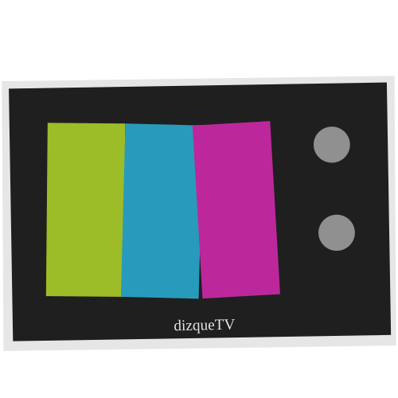

# dizqueTV 1.2.5
  

Create live TV channel streams from media on your Plex servers.

**dizqueTV** ( *dis·keˈtiːˈvi* )  is a fork of the project previously-known as [pseudotv-plex](https://gitlab.com/DEFENDORe/pseudotv-plex) or [pseudotv](https://github.com/DEFENDORe/pseudotv). New repository because of lack of activity from the main repository and the name change is because projects with the old name already existed and were created long before this approach and it was causing confusion. You can migrate from pseudoTV 0.0.51 to dizqueTV by renaming the .pseudotv folder to .dizquetv and running the new executable (or doing a similar trick with the volumes used by the docker containers).



Configure your channels, programs, commercials and settings using the dizqueTV web UI.

Access your channels by adding the spoofed dizqueTV HDHomerun tuner to Plex, Jellyfin or emby or utilize the M3U Url with any 3rd party IPTV player app.

EPG (Guide Information) data is stored to `.dizquetv/xmltv.xml`

## Features
- A wide variety of options for the clients where you can play the TV channels, since it both spoofs a HDHR tuner and a IPTV channel list.
- Ease of setup for xteve and Plex playback by mocking a HDHR server.
- Configure your channels once, and play them just the same in any of the other devices.
- Customize your channels and what they play. Make them display their logo while they play. Play filler content (&quot;commercials&quot;, music videos, prerolls, channel branding videos) at specific times to pad time.
- Docker image and prepackage binaries for Windows, Linux and Mac.
- Supports nvidia for hardware encoding, including in docker.
- Select media (desired programs and commercials) across multiple Plex servers
- Includes a WEB TV Guide where you can even play channels in your desktop by using your local media player.
- Subtitle support.
- Auto deinterlace any Plex media not marked `"scanType": "progressive"`
- Can be configured to completely force Direct play, if you are ready for the caveats.

## Limitations

- If you want to play the TV channels in Plex using the spoofed HDHR, Plex pass is required.
- dizqueTV does not currently watch your Plex server for media updates/changes. You must manually remove and re-add your programs for any changes to take effect. Same goes for Plex server changes (changing IP, port, etc).. You&apos;ll have to update the server settings manually in that case.
- Most players (including Plex) will break after switching episodes if video / audio format is too different. dizqueTV can  be configured to use ffmpeg transcoding to prevent this, but that costs resources.
- If you configure Plex DVR, it will always be recording and transcoding the channel&apos;s contents.

## Releases

- https://github.com/vexorian/dizquetv/releases

## Wiki

- For setup instructions, check [the wiki](https://github.com/vexorian/dizquetv/wiki)


## App Preview

<br/>

<br/>

<br/>


## Development
Building/Packaging Binaries: (uses `browserify`, `babel` and `pkg`)
```
npm run build
npm run compile
npm run package
```

Live Development: (using `nodemon` and `watchify`)
```
npm run dev-client
npm run dev-server
```

## Contribute

* Pull requests welcome but please read the [Code of Conduct](CODE_OF_CONDUCT.md) and the [Pull Request Template](pull_request_template.md) first.
* Tip Jar: https://buymeacoffee.com/vexorian

## License

 * Original pseudotv-Plex code was released under [MIT license (c) 2020 Dan Ferguson](https://github.com/DEFENDORe/pseudotv/blob/665e71e24ee5e93d9c9c90545addb53fdc235ff6/LICENSE)
 * dizqueTV's improvements are released under zlib license (c) 2020 Victor Hugo Soliz Kuncar
