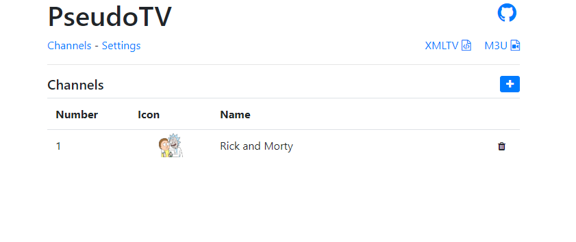
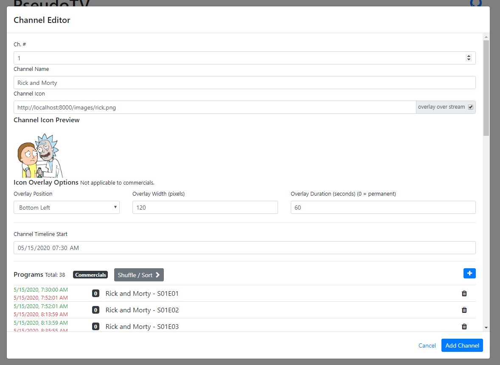
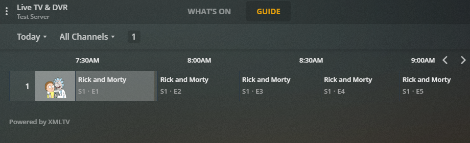
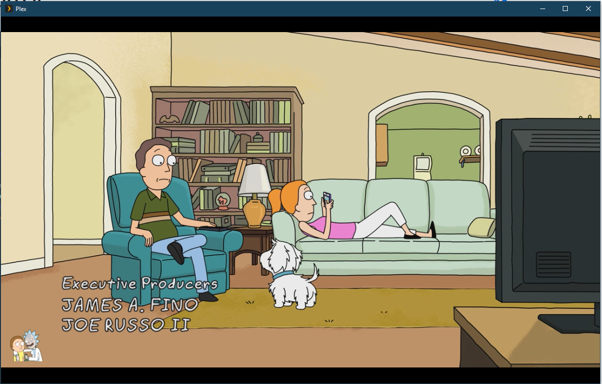

# pseudotv-plex

Create live TV channel streams from media on your Plex servers.

Project recently migrated from [gitlab](https://gitlab.com/DEFENDORe/pseudotv-plex) to github to improve development flow (docker builds and binary releases).


Configure your channels, programs, commercials and settings using the PseudoTV web UI.

Access your channels by adding the spoofed PseudoTV HDHomerun tuner to Plex, or utilize the M3U Url with any 3rd party app.

EPG (Guide Information) data is stored to `.pseudotv/xmltv.xml`

## Features
- Docker image and prepackage binaries for Windows, Linux and Mac
- Web UI for channel configuration and app settings
- Select media (desired programs and commercials) across multiple Plex servers
- Sign into your Plex servers using any sign in method (Username, Email, Google, Facebook, etc.)
- Ability to auto update Plex DVR guide data and channel mappings
- Auto update the xmltv.xml file at a set interval (in hours). You can also set the amount EPG cache (in hours).
- Continuous playback support
- Commercial support. 5 commercial slots for a program (BEFORE, 1/4, 1/2, 3/4, AFTER). Place as many commercials as desired per slot to chain commercials.
- Media track selection (video, audio, subtitle). (subtitles disabled by default)
- Subtitle support (some subtitle formats may cause a delay when starting an ffmpeg session) Supported subs below.
    - Internal Subs
        - ASS (slow)
        - SRT (slow)
        - PGS (fast)
    - External Subs
        - ASS (moderate)
        - SRT (moderate)
- Ability to overlay channel icon over stream
- Auto deinterlace any Plex media not marked `"scanType": "progressive"`

## Useful Tips/Info

- Internal and External SRT/ASS subtitles may cause a delay when starting stream (only when subtitles are activated). For internal SRT/ASS subtitles, FFMPEG needs to perform a subtitle track extraction from the original media before the requested stream can be started. External SRT/ASS subtitle files still need to be sliced to the correct start time and duration so even they may cause a delay when starting a stream. Image based subs (PGS) should have little to no impact.
- Utilize your hardware accelerated encoders, or use mpeg2 instead of h264 by changing the default video encoder in FFMPEG settings. *Note that some encoders may not be capable of handling every transcoding scenario, libx264 and mpeg2video seem to be the most stable.*
    - Intel Quick Sync: `h264_qsv`, `mpeg2_qsv`
    - NVIDIA GPU: `h264_nvenc`
    - MPEG2 `mpeg2video`
    - H264 `libx264` (default)
    - MacOS `h264_videotoolbox`
    - **Enable the option to log ffmpeg's stderr output directly to the pseudotv app console, for detecting issues**
- Host your own images for channel icons, program icons, etc.. Simply add your image to `.pseudotv/images` and reference them via `http://pseudotv-ip:8000/images/myImage.png`
- Use the Block Shuffle feature to play a specified number of TV episodes before advancing to the next available TV show in the channel. You can also specify to randomize the TV Show order. Any movies added to the channel will be pushed to the end of the program lineup, this is also applicable the "Sort TV Shows" option.
- Plex is smart enough not to open another stream if it currently is being viewed by another user. This allows only one transcode session for mulitple viewers if they are watching the same channel.
- Even if your Plex server is running on the same machine as the PseudoTV app, use your network address (not a loopback) when configuring your Plex Server(s) in the web UI.

## Limitations

- Plex Pass is required to unlock Plex Live TV/DVR feature
- Only one EPG source can be used with Plex server. This may cause an issue if you are adding the pseudotv tuner to a Plex server with Live TV/DVR already enabled/configured.
- PseudoTV does not watch your Plex server for media updates/changes. You must manually remove and readd your programs for any changes to take effect. Same goes for Plex server changes (changing IP, port, etc).. all media will fail..


## Installation

*Please delete your old `.pseudotv` directory before using the new build. I'm sorry but it'd take more effort than its worth to convert the old databases..*

Unless your are using Docker/Unraid, you must download and install **ffmpeg** to your system and set the correct path in the PseudoTV Web UI.

By default, pseudotv will create the directory `.pseudotv` wherever pseudotv is launched from. Your `xmltv.xml` file and config databases are stored here.

#### Binary Release
[Download](https://github.com/DEFENDORe/pseudotv/releases) and run the PseudoTV executable (argument defaults below)
```
./pseudotv-win-x64.exe --port 8000 --database ./pseudotv
```

#### Docker

The Docker repository can be viewed [here](https://hub.docker.com/r/defendore/pseudotv).

Use Docker to fetch PseudoTV, then run the container.. (replace `C:\.pseudotv` with your desired config directory location)
```
docker pull defendore/pseudotv
docker run --name pseudotv -p 8000:8000 -v C:\.pseudotv:/home/node/app/.pseudotv defendore/pseudotv
```

#### Building Docker image from source

Build docker image from source and run the container. (replace `C:\.pseudotv` with your desired config directory location)

```
git clone https://github.com/DEFENDORe/pseudotv
cd pseudotv-plex
docker build -t pseudotv .
docker run --name pseudotv -p 8000:8000 -v C:\.pseudotv:/home/node/app/.pseudotv pseudotv
```

#### Unraid Install
Add
```
https://github.com/DEFENDORe/pseudotv
```
to your "Template repositories" in the Docker tab.
Click the "Add Container" button
Select either the pseudotv template or the pseudotv-nvidia template if you want nvidia hardware accelerated transcoding.
Make sure you have the Unraid Nvidia plugin installed and change your video encoder to h264_nvenc in the pseudotv ffmpeg settings.

#### From Source

Install NodeJS and FFMPEG

```
git clone https://github.com/DEFENDORe/pseudotv
cd pseudotv-plex
npm install
npm run build
npm run start
```

## Plex Setup

Add the PseudoTV spoofed HDHomerun tuner to Plex via Plex Settings.

If the tuner isn't automatically listed, manually enter the network address of pseudotv. Example:
```
127.0.0.1:8000
```

When prompted for a Postal/Zip code, click the `"Have an XMLTV guide on your server? Click here to use that instead."` link.

Enter the location of the `.pseudotv/xmltv.xml` file. Example (Windows):
```
C:\.pseudotv\xmltv.xml
```

**Do not use the Web UI XMLTV URL when feeding Plex the xmltv.xml file. Plex fails to update it's EPG from a URL for some reason (at least on Windows). Use the local file path to `.pseudotv/xmltv.xml`**

## App Preview

<br/>

<br/>

<br/>


## Development
Building/Packaging Binaries: (uses `browserify`, `babel` and `pkg`)
```
npm run build
npm run compile
npm run package
```

Live Development: (using `nodemon` and `watchify`)
```
npm run dev-client
npm run dev-server
```
